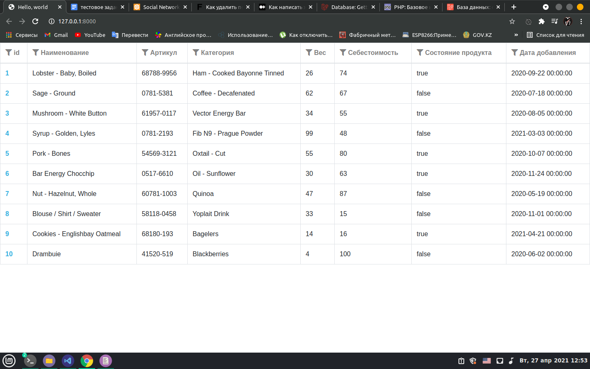
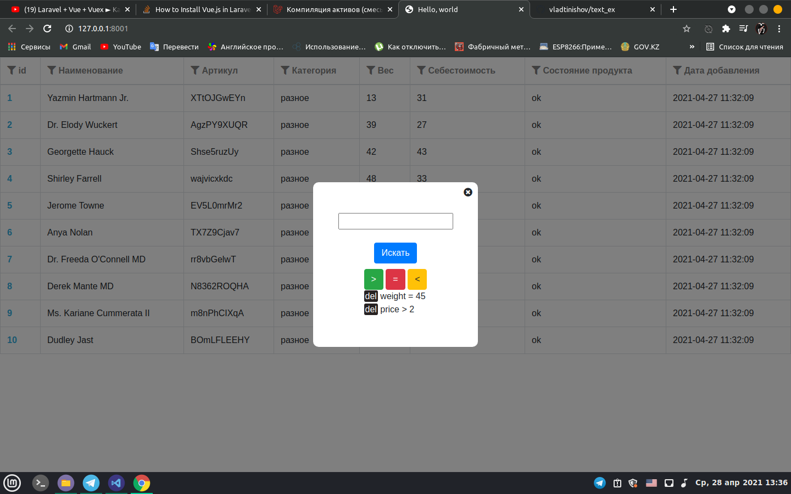

<h1>Тестовый проект</h1>

Проект выполнен по тестовому заданию и выводит таблицу с первыми 10 записями из базы данных

Есть поддержка фильтров у каждой колонки

Проект разарботан на Laravel с использованием Vue.js и Postgresql

Используется база данных Shop

Настройки подключения к базе данных проводится в файле .env 

Вид таблицы

Вид фильров

Использованная тестовая <a href="products.sql">таблица</a>
